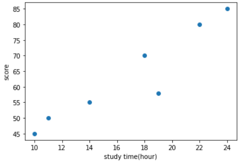
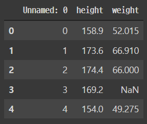
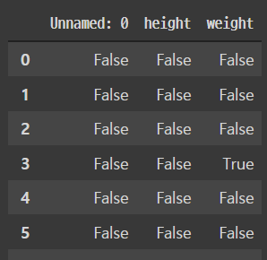
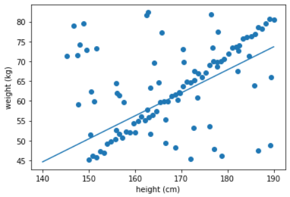

# Pytorch 기본

> Tensor의 개념
>
> 선형 모델로 간단한 데이터 모델 예측

## 1. Tensor manipulation

> 참고 자료: https://wikidocs.net/52460 

1. Tensor의 차원과 형태 관련

   1. `dim()`: Tensor의 차원을 반환하는 method
   2. `shape`: Tensor의 모양 (attribute이다.)
   3. `size()`: Tensor의 모양을 반환하는 method

   ```python
   import torch
   X = torch.rand(3, 4) # 0~1 사이의 값을 가지는 랜덤 matrix 생성 (3행 4열)
   
   print('X.dim()', X.dim())
   print('X.shape', X.shape)
   print('X.size()', X.size())
   ```

   ```bash
   >> X.dim() 2
   >> X.shape torch.Size([3, 4])
   >> X.size() torch.Size([3, 4])
   ```

   

2. Matmul과 mul의 차이

   1. `X.matmul(Y)`: 행렬 곱 (내적)

      - matmul 연산 시 batch 사이즈(0번째 차원)가 같아야 함

      - 인공지능의 빠른 학습을 위해 배치 연산 (여러 데이터를 병렬적으로 학습) 시 사용

        ```python
        X = torch.rand(3, 2, 5) # (2, 5) 짜리 matrix가 3개 있는 tensor
        Y = torch.rand(3, 5, 3) # (5, 3) 짜리 matrix가 3개 있는 tensor
        
        D = X.matmul(Y)
        print(D.shape) # torch.Size([3, 2, 3])
        ```

   2. `X.mul(Y)`: 각 원소 별로 곱하는 연산

      - 각 원소별로 곱하므로 두 Tensor의 사이즈가 같아야 함

      - X*Y와 동일

        ```python
        X = torch.rand(3, 5)
        Y = torch.rand(3, 5)
        print(X.mul(Y))
        print(X*Y)
        ```

        

3. Broadcasting
   - Tensor의 shape가 서로 다를 때  broadcasting을 통해 자동으로 크기를 조절하여 연산이 가능하도록 만들어 줌
   - 매번 복제하는 코드를 명시적으로 구현할 필요 없이 매우 편리하게 응용될 수 있지만, 의도치않게 broadcasting이 되면 디버깅이 어려워질 수 있음


4. `view()` (numpy의 경우 `reshape()`)
   - Tensor의 shape를 바뀌어야 할 경우 사용

	```python
    X = torch.rand(3, 2, 5)
    X.shape # torch.Size([3, 2, 5])
    X.view(3, 10).shape # torch.Size([3, 10])
   ```


5. axis
   - 다차원 텐서에 해당 함수 연산을 어떤 축으로 적용할 지 결정하는데 사용
   - 함수의 매개변수 중 하나로 자주 등장


6. squeeze & unsqueeze

   - 특정 차원이 1인 경우 축소시키거나 차원을 확장시킬 때 사용
   - broadcasting 시 많이 사용되는 연산

   ```python
   X = torch.rand(100, 1, 20)
   torch.squeeze(X) # torch.Size([100, 20])
   ```


7. type casting
   - 컴퓨터는 여러가지 자료형(int, float, uint8 등)이 있음. 이러한 type이 같지 않으면 수치적인 문제가 발생할 수 있으므로 유의해야 함


8. concatenate
   - 두 개 이상의 Tensor들을 지정된 축으로 쌓아서 더 큰 Tensor를 만드는 함수
   - 하나의 Tensor로 합치기 위한 입력 Tensor들은 concatenate 하는 축을 제외하고는 모두 같은 크기를 가져야 함


## 2. 선형 모델에서의 learnable parameter 탐색

> f(x) = Wx+b 에 대해서 주어진 데이터를 제일 잘 표현하는 weight W와 bias b 탐색하기

### 1. 연습문제 (1)

1. 필요한 라이브러리 import

   ```python
   from __future__ import print_function, division
   import os
   import torch
   import pandas as pd
   # from skimage import io, transform
   import numpy as np
   import warnings
   warnings.filterwarnings("ignore")
   ```


2. 데이터 - 공부 시간과 성적의 관계

    | Study time | Grade |
    | ---------- | ----- |
    | 10         | 45    |
    | 11         | 50    |
    | 14         | 55    |
    | 18         | 70    |
    | 19         | 58    |
    | 22         | 80    |
    | 24         | 85    |


3. Study time / Grade에 대한 Tensor 생성 (shape는 [7, 1], dimension은 2)

   ```python
   x_train = torch.FloatTensor([10], [11], [14], [18], [19], [22], [24])
   y_train = torch.FloatTensor([45], [50], [55], [70], [58], [80], [85])
   print(x_train.shape, x_train.dim()) # torch.Size([7, 1]) 2
   ```

   

4. x_train, y_train 시각화 (시각화 라이브러리 matplotlib 사용)

   ```python
   # jupyter notebook이나 colab에서 사용 시 이렇게 import
   %matplotlib inline
   import matplotlib.pyplot as plt
   ```

   ```python
   plt.scatter(x_train, y_train) # 점 찍기
   plt.xlabel('study time(hour)') # x축의 label
   plt.ylabel('score') # y축의 label
   plt.show() # print 같은 느낌
   ```

   결과물

   


5. Colab과 Gdrive 연동

   ```python
   from google.colab import drive
   drive.mount('/content/gdrive')
   ```


6. Gdrive에서 csv 파일 가져오기

   ```python
   import pathlib
   path = pathlib.Path('/content/gdrive/My Drive/health_data.csv') 
   
   data_file = pd.read_csv(path)
   data_file.head()
   ```

   결과물

   


7. 불완전한 데이터(ex. NaN) 제거하는 전처리 작업

   1. 데이터셋 안에 NaN 혹은 null이 있는지 체크 - pandas의 insull() 이용

      ```python
      data_file.isnull()
      ```

      결과물

      

   2. 불완전한 행 제거 - pandas의 dropna() 이용

      ```python
      # dropna(): 숫자가 아닌 것을 제거하는 method
      # axis = 0: 행을 제거하라
      data_file = data_file.dropna(axis=0).reset_index(drop=True)
      data_file.head()
      ```


8. csv 파일을 pytorch에서 사용할 수 있도록 tensor 형태로 변환

   ```python
   height = torch.tensor(data_file.height)
   weight = torch.tensor(data_file.weight)
   print(height)
   print(height.shape)
   ```

   ```bash
   tensor([158.9000, 173.6000, 174.4000, 154.0000, 177.7000, 188.3000, 183.4000,
           168.7000, 185.1000, 156.5000, 160.6000, 169.5000, 167.9000, 154.8000,
           163.0000, 176.1000, 186.7000, 172.0000, 165.5000, 187.5000, 157.3000,
           158.1000, 175.3000, 166.3000, 153.2000, 159.7000, 155.7000, 152.4000,
           181.8000, 151.6000, 190.0000, 161.4000, 171.2000, 163.8000, 162.2000,
           164.6000, 172.8000, 185.9000, 150.8000, 189.1000, 179.3000, 180.2000,
           178.5000, 170.4000, 150.0000, 167.1000, 184.2000, 182.6000, 176.9000,
           181.0000], dtype=torch.float64)
   torch.Size([50])
   ```

   

9. shape와 dimension 맞추고 자료형 float 타입으로 변환

   - [50] -> [50, 1] 변환

   ```python
   x_train = height.view([height.shape[0], 1]).float()
   y_train = weight.view([weight.shapep[0], 1]).float()
   ```


10. 랜덤으로 만든 데이터 추가하기

    - x_train dataset의 경우 145~190 사이의 랜덤한 숫자 50개
    - y_train dataset의 경우 45~85 사이의 랜덤한 숫자 50개 생성하여 concatenate

    ```python
    x_train = torch.cat((torch.rand(50, 1)*45+145, x_train), axis=0)
    y_train = torch.cat((torch.rand(50, 1)*40+45, y_train), axis=0)
    ```

    

### 2. 연습문제 (2)

> y = Wx+b에서 적합한 W, b를 찾기 위해 랜덤하게 W와 b를 바꿔가면서 training dataset을 가장 잘 fitting하는 파라메터 탐색하기

1. 총 50000번 W, b 값을 바꾸어 training dataset에 가장 잘 맞는 W, b 찾기
2. Try & Error - 랜덤으로 실수 생성하여 W, b에 할당. 이를 이용하여 y 예측 시도
3. hypothesis = Wx + b
4. 현재 구한 직선(hypothesis)이 데이터에 잘 맞는지 확인하는 방법으로 error |hypothesis-y|의 합으로 구하여 loss로 명명 (L1 loss |hypothesis-y|는 L2 loss(hypothesis-y)²) 에 비해 거짓 데이터에 강함)
5. 이전에 구했던 loss의 값보다 더 작은 loss가 나올 경우 min_loss에 현재의 loss를, min_W과 min_b에는 현재 W와 b를 저장

```python
iter = 50000 #loss값을 구하는 횟수로 총 50000번 
weight_max = 100 #'[입력범위]'로 random값의 weight 범위 제한 목적 ( -50 < weight < 50 )
bias_max = 150 #오프셋으로 random값의 bias 범위 제한 목적 (-150 < bias < 0)
min_loss = 1000000 #업데이트 된 가장 작은 값의 loss 저장 
min_W = 0 
min_b = 0
iteration = 0

#dataset
x = x_train
y = y_train

def loss_fn(hypo, GT):
  return sum(abs(hypo - GT))

for i in range(iter):
  W = (torch.rand(1)-0.5) * weight_max # -50~50 중 랜덤
  b = (-torch.rand(1)) * bias_max # -150~0 중 랜덤
  hypothesis = x * W +b
  
  cur_loss = loss_fn(hypothesis,y)

  if cur_loss < min_loss:
    min_loss = cur_loss
    min_W = W
    min_b = b
    
  iteration += 1

print('iteration: ', iteration)
print('min_loss: ', min_loss)
print(min_W, min_b)
```

```bash
iteration:  50000
min_loss:  tensor([745.4248])
tensor([0.5805]) tensor([-36.6255])
```

데이터 시각화

- numpy의 `arange([start, ] stop, [step, ] dtype=None)`: 반열린구간 [start, stop) 에서 step 크기만큼 일정하게 떨어져 있는 숫자들을 array 형태로 반환해주는 함수
  - start 값이 없다면 0이 default, step 값이 없다면 1이 default
  - dtype: 결과로 반환되는 array의 type을 지정할 때 사용

```python
%matplotlib inline
import matplotlib.pyplot as plt
import numpy as np

x = x_train
y = y_train

plt.scatter(x, y)

t = np.arange(140.,190.,0.001)

plt.plot(t, min_W*t+min_b)
plt.xlabel('height (cm)')
plt.ylabel('weight (kg)')
plt.show()
```

결과물


